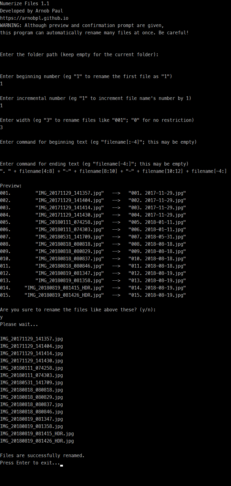

# Rename Files
Using this program, it is easy to rename multiple files at once. You can preview what changes are going to happen in file names.

## Run
This program has been created with **Python 3**. It can run on Windows, Mac, Linux. Before running the program, please make sure that you have installed Python (version 3 onwards) in your computer. There are two *py* files in the program:
  - **NumerizeFiles**: To add numbers in file names (stateful), and also modify file names optionally
  - **RenameFiles**: To modify file names without adding any number (stateless)

## Usage
The program is very easy to learn. For your convenience, you may know some *substring* operations in Python (such as [this](https://stackoverflow.com/a/663175/2548628)). The following screenshot shows a typical example of how to rename image files using the program (`NumerizeFiles.py` file, to be specific).

